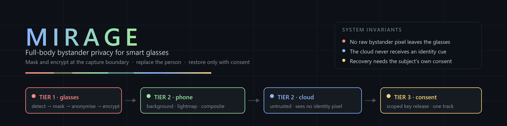
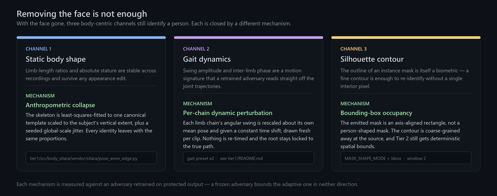
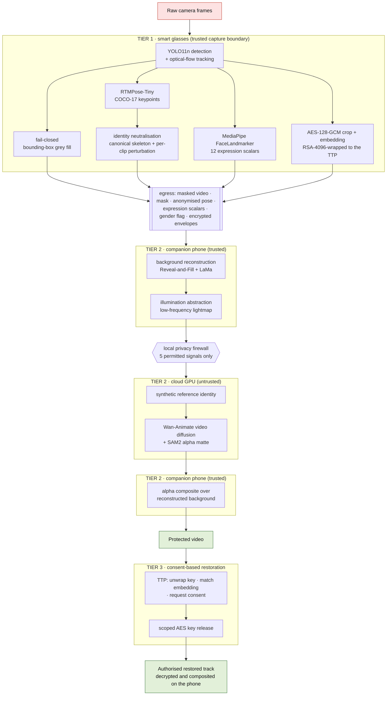
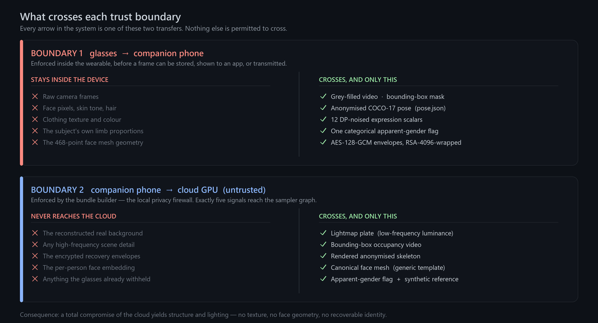
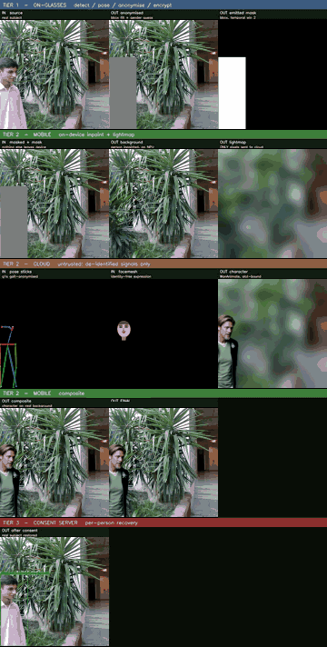
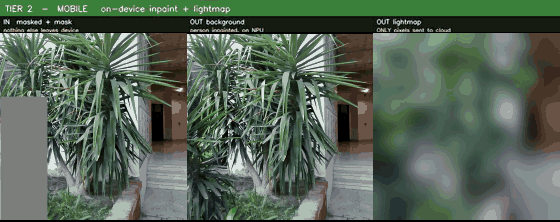
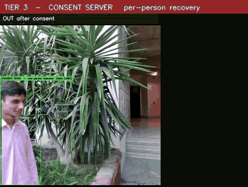
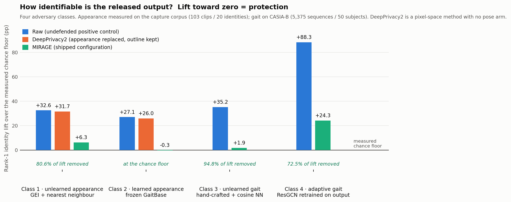
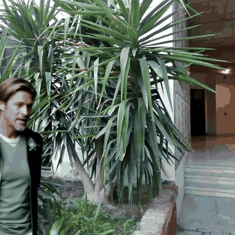
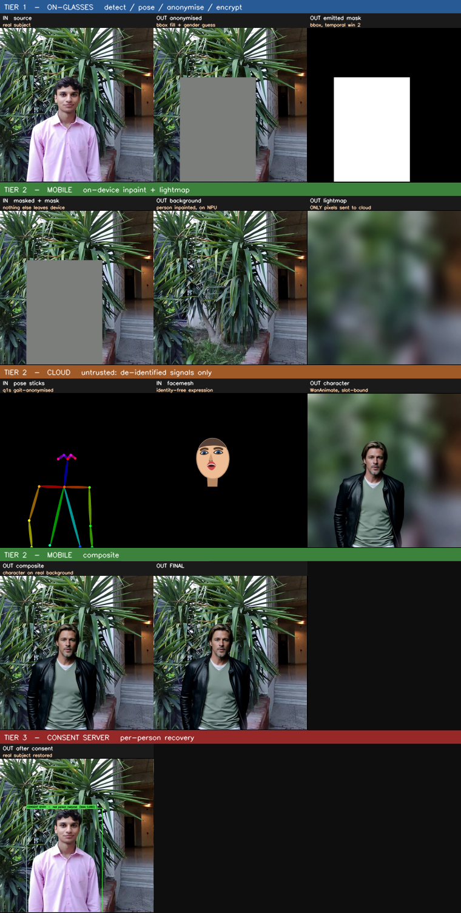

<div align="center">



<p>
  
  
  
  
  
  
</p>

**Reference implementation for the paper**
**"MIRAGE: Privacy-Preserving Full-Body Identity Replacement with Consent-Based Restoration for Smart Glasses"**
*(under double-blind review; authorship metadata is withheld until the process concludes)*

</div>

---

Smart glasses record the people around the wearer whether or not those people agreed to it. Blurring
their faces is not enough, because a person can be re-identified from gait, silhouette, body shape
and clothing even when the face is completely removed. MIRAGE (Mobile Identity Replacement via
AI-Generated Embodiment) therefore treats the whole visible person as the biometric, and protects
every bystander before a single frame leaves the camera.


> One real clip. **Left:** what the camera saw. **Centre:** what everyone gets: the bystander is
> replaced by a synthetic person who moves the way they did. **Right:** what that one bystander can
> unlock, for their own track only, by giving consent afterwards.

The design enforces three properties:

| | |
|---|---|
| 🔒 &nbsp;**Fail-closed at the source** | Masking and encryption happen inside the glasses. If the network dies or generation fails, the bystander is still covered. |
| 🕶️ &nbsp;**The cloud is blind** | The GPU that draws the replacement person receives structure and lighting only. It never receives texture, a face, or the real background. |
| 🤝 &nbsp;**Consent is scoped** | An approval unlocks one recording, one person, one interval. Everyone else in the frame stays synthetic. |

---

## Table of contents

[Why face blurring is not enough](#why-face-blurring-is-not-enough) · [System overview](#system-overview) ·
[Trust boundaries](#trust-boundaries) · [The three tiers](#the-three-tiers) ·
[Results at a glance](#results-at-a-glance) · [Quick start](#quick-start) ·
[Repository map](#repository-map) · [Input and output contracts](#input-and-output-contracts) ·
[Reproducing paper results](#reproducing-paper-results) · [Requirements](#hardware-and-software-requirements) ·
[Known limitations](#known-limitations) · [Citation](#citation) · [License](#license)

---

## Why face blurring is not enough



Person re-identification does not need a face. It needs a body, and a body leaks identity along
three independent channels: static proportions, motion dynamics, and the silhouette contour itself.
MIRAGE closes each channel with a different mechanism, and prices each one against an adversary
retrained on protected output, because a frozen adversary has repeatedly mispriced the same
mechanism by large factors, in both directions.

The pose channel makes this concrete. Tier 1 never exports the subject's own skeleton:


Same subject, same frame, same capture (a separate single-person clip run with the defences off and
on). The left side is what the pose estimator produced. The right side is what actually leaves the
device: one shared anatomical template, per-limb-chain swing and phase drawn from a fresh seed every
clip, and unsupported free ends pruned rather than invented. Nothing is re-timed, and the root stays
locked to the subject's real path, so the figure still walks where they walked and never drifts off
its own mask.

---

## System overview

MIRAGE is a split wearable-companion-cloud system organised as three tiers. Tier 1 runs on the
glasses and enforces privacy at capture time. Tier 2 spans the trusted companion phone and an
untrusted cloud GPU, and replaces each bystander with a synthetic person. Tier 3 is the
consent-based restoration path, mediated by a trusted third party (TTP).



| Component | Runs on | Does | Entry point |
|---|---|---|---|
| 🔴 **Tier 1** | Raspberry Pi 5 (wearable proxy) | Detect, track, fail-closed mask, anonymise pose, derive expression controls, encrypt recovery envelopes | [`tier1/scripts/run_tier1.py`](tier1/scripts/run_tier1.py) |
| 🟢 **Tier 2 · phone** | Galaxy S25 Ultra (Snapdragon 8 Elite) | Rebuild the person-free background, abstract illumination, composite | [`tier2_phone/app/`](tier2_phone/app/) |
| 🔵 **Tier 2 · cloud** | CUDA GPU running ComfyUI | Animate a synthetic identity from de-identified controls only | [`tier2_cloud/scripts/queue_render.py`](tier2_cloud/scripts/queue_render.py) |
| 🟡 **Tier 3** | Trusted third party + phone | Consent-scoped key release and per-track restoration | [`tier3_restoration/`](tier3_restoration/) |

---

## Trust boundaries



Everything in the system reduces to these two transfers. The first is enforced inside the wearable,
before a frame can be stored, shown to an application or transmitted. The second is enforced by the
bundle builder (the local privacy firewall), which constructs the cloud payload from exactly five
permitted signals and refuses to assemble anything else.

Full detail: [`docs/architecture.md`](docs/architecture.md).

---

## The three tiers



*The whole system on a single clip, row by row: Tier 1 on the glasses, Tier 2 on the phone,
Tier 2 in the cloud, Tier 2 back on the phone, and Tier 3 restoration. Each panel below is one row
of this figure, enlarged.*

### 🔴 Tier 1: on-device privacy enforcement


Person regions become a uniform grey fill over an axis-aligned bounding box. The rectangle is a
deliberate privacy decision rather than a shortcut. A person-shaped mask leaks its own contour, so
coarse-graining the mask to a rectangle removes the silhouette channel at the source while still
giving Tier 2 deterministic spatial bounds. The mitigation is monotone by construction, meaning it
can only ever add grey; it can never retract and reveal.

In parallel, Tier 1 exports the anonymised skeleton, twelve identity-free expression scalars
(smoothed, quantised and noised at a per-frame epsilon of 3.0), and a single categorical apparent-gender
flag. It also encrypts the original person crop and a 512-d face embedding under a per-person
AES-128-GCM key, wrapped to the Tier-3 TTP with RSA-4096.

<details>
<summary><b>Shipped anti-re-identification configuration</b></summary>

| Parameter | Shipped value | Scope |
|---|---|---|
| Anthropometric normalisation | canonical template, least-squares vertical-extent fit + seeded global-scale jitter of at most 0.10 | per clip |
| Joint-angle perturbation | 14 deg constant / 10 deg drift, arm chains only (legs exempt) | per clip |
| Limb-swing amplitude rescale | 0.25, about each limb chain's mean pose | per clip |
| Per-chain temporal phase | amplitude 1.80, constant offset drawn up to 0.35 s | per clip |
| Cadence re-timing | disabled; root trajectory locked to the subject's true path | n/a |
| Perturbation seed | cryptographically fresh per clip, never identity-derived | per clip |
| Free-end keypoint pruning | enabled | per frame |
| Silhouette mode | axis-aligned bounding box, 2-frame temporal window | per frame |

Seeding per sequence, never per identity, is load-bearing: an identity-derived seed turns the
perturbation itself into a stable signature. See [`tier1/README.md`](tier1/README.md).

</details>

### 🟢 Tier 2: companion phone



The phone has to restore scene context without letting the real background reach the cloud. It
aligns neighbouring frames to recover the background that the subject's own motion progressively
reveals, fills the never-revealed core once with LaMa, then destroys the remaining detail with a
heavy downsample, a Gaussian blur, and a rescale. What survives is ambient colour and lighting
direction. What does not survive is the scene itself.

That abstracted plate, not the real background, is what continues to the cloud.
See [`tier2_phone/README.md`](tier2_phone/README.md).

### 🔵 Tier 2: cloud synthesis


The untrusted service is an appearance engine driven by structure. Identity comes from a supplied
synthetic character sheet, and behaviour comes from the controls. Nothing in the graph can read the
subject's appearance, because nothing carrying it is loadable: all five video inputs are Tier-1 or
Tier-2 artifacts. See [`tier2_cloud/README.md`](tier2_cloud/README.md).

### 🟡 Tier 3: consent-based restoration



Encrypted envelopes go to the trusted third party; media never does. The TTP unwraps the symmetric
key, matches the embedding against registered templates, and asks the matched person. On approval
it releases only the keys bound to that track and interval, and decryption happens on the phone.

> **Implementation status.** The envelope side (AES-128-GCM packets, RSA-4096 wrapping, embedding
> extraction, and decryption of a released packet) is implemented and exercised end to end. The
> consent server itself (matching, consent dispatch, key release) is not part of this release.
> See [`tier3_restoration/README.md`](tier3_restoration/README.md).

---

## Results at a glance

Headline numbers from the paper's evaluation, with the harness that produced each one. Every
privacy number is reported as lift over a measured chance floor, because raw accuracy without its
gallery chance floor is uninformative.



**Capture boundary** (16,507 hand-verified frames, 11 scene categories):

| Metric | Value |
|---|---|
| Full-body detection, AP / AR at IoU 0.5 | 0.948 / 0.976 |
| Pixel-level person coverage (SAM2 pseudo-ground-truth) | 0.9848 |
| Detector skip interval | n = 5 (Pareto-optimal: precision 0.9493 vs the 0.9498 no-skip ceiling, at one sixth the processing time) |

**Appearance-based re-identification** (silhouette channel; 103 clips, 20 identities;
`evaluation/privacy/silhouette/`):

| Adversary | Raw (positive control) | DeepPrivacy2 | MIRAGE (bounding-box masking) | Chance floor |
|---|---|---|---|---|
| Class 1: unlearned, GEI + nearest neighbour, Rank-1 | 43.67 % | 42.76 % | **17.42 %** | 11.10 % |
| Class 1, **Rank-5** | 82.58 % | 81.90 % | **64.93 %** | 55.59 % |
| Class 2: learned, frozen GaitBase, Rank-1 | 38.24 % | 37.10 % | **10.86 %** | 11.12 % |
| Class 2, **Rank-5** | 77.83 % | 76.70 % | **54.98 %** | 55.39 % |

Against the learned adversary MIRAGE sits at the measured chance floor (lift of -0.27 pp), which
removes the entire available identity lift. DeepPrivacy2, run exactly as published on the same
footage, removes 2.8 % and 4.2 % of the Class 1 and Class 2 lift respectively: replacing appearance
while keeping the source silhouette leaves this channel almost untouched.

> 🔴 **That "at chance" is specific to adversaries that normalise size away, and both of these do.**
> The shipped defence replaces each person with a filled rectangle, so after the (T,64,64)
> size-normalisation both Classes 1 and 2 apply, a defended clip is a white square -- 10 of 103
> collapse to bit-identical GEIs. A **box-native** adversary, reading the emitted rectangle's
> geometry in native pixels instead, was measured on 2026-08-28 (103 clips, 20 identities, same
> imported gallery and permutation null, which independently reproduced the 11.1 % chance floor):
>
> | Arm | Rank-1 | 95 % CI | Null | Lift |
> |---|---|---|---|---|
> | undefended silhouette box | 23.08 % | [18.06, 39.80] | 11.15 % | +11.93 pp |
> | **MIRAGE (shipped)** | **19.23 %** | [14.51, 32.29] | 11.12 % | **+8.11 pp** |
>
> **The defence removes 32 % of this adversary's lift, not 80.6 %.** The defended arm's interval
> excludes its own null, and overlaps the undefended arm throughout -- on this channel we cannot
> show that the defence helps. The carrier is stature alone: median box height *by itself* scores
> 21.72 %, and deleting the four size features leaves a residual that is no longer significant. The
> emitted box preserves height to within 0.3-0.7 % of the true silhouette.
>
> Two things this is **not**. It is not a large absolute risk: this attacker reaches only 23.08 % on
> *undefended* silhouettes where Class 1 reaches 82.58 %, so box geometry is a far poorer signal
> than a silhouette. And it is not a point estimate: apparent size mixes stature with camera
> distance, so +8.11 pp is an upper bound and the scale-free +3.48 pp (not significant) is the
> lower. The finding is about the defence's **coverage**, and it is unfixed.

**Gait-based re-identification** (pose channel; 5,375 walking sequences, 50 identity-disjoint
subjects; `evaluation/privacy/gait/`):

| Adversary | Raw (positive control) | MIRAGE (pose anonymiser) | Chance floor | Lift removed |
|---|---|---|---|---|
| Class 3: unlearned, hand-crafted + cosine NN, Rank-1 | 37.18 % | **3.78 %** | 1.93 % | 94.8 % |
| Class 3, **Rank-5** | 64.02 % | **14.02 %** | 9.50 % | 91.7 % |
| Class 4: adaptive, ResGCN retrained on protected output, Rank-1 | 90.25 ± 1.14 % | **26.20 ± 0.57 %** | 1.93 % | 72.5 % |
| Class 4, **Rank-5** | 96.89 % | **58.06 %** | 9.50 % | 44.4 % |

🔴 **Read the rank-5 row before quoting the rank-1 one.** Against the adaptive adversary the
protected output still places the correct identity in the top five for **58 % of sequences, about
six times the 9.50 % chance floor**, and only 44 % of the available rank-5 lift is removed. If the
realistic threat is shortlisting a bystander rather than naming one outright, rank-5 is the number
that describes it. The same caution applies to Class 1, where rank-5 sits at 64.93 % against a
55.59 % floor. This is mitigation, not anonymisation, and the paper should be read that way.

The Class 4 residual is stated plainly in the paper and here: the motion channel is strong,
measured mitigation, not complete anonymisation. Closing the remaining adaptive lift is an open
problem.

**Visual utility** (protected output vs an unanonymised WanAnimate baseline, matched seeds and
settings; `evaluation/quality/`):

| Metric | WAN baseline | MIRAGE |
|---|---|---|
| SSIM (higher is better) | 0.808 ± 0.009 | 0.812 ± 0.008 |
| PSNR (dB) | 16.13 ± 0.40 | 14.95 ± 0.25 |
| LPIPS (lower is better) | 0.198 ± 0.008 | 0.232 ± 0.009 |
| FID | 124.0 | 169.1 |
| Anatomical artifacts (e.g. invented hands) | 0.00 % | 0.00 % |

Structural fidelity matches the unconstrained baseline; the perceptual gap is the intended cost of
replacing real texture with a synthetic character.

**System cost** (`evaluation/performance/`):

| Measurement | Value |
|---|---|
| Tier 1 energy per 10 s clip (Raspberry Pi 5, shunt-measured) | 159.5 J core privacy / 186.3 J with synthesis export, vs 59.87 J idle (2.66x / 3.11x) |
| Tier 1 effective post-capture tail latency | 10.68 s core / 15.77 s full, per 10 s clip |
| On-device storage overhead at the deployed JPEG Q70 point | 93.3 % of raw video (vs roughly 1616 % uncompressed) |
| Tier 2 phone compute per 10 s clip (S25 Ultra) | 5.26 min background job; 1,488.9 J, about 2.15 % of a 5,000 mAh battery |

---

## Quick start

```bash
# The repository URL is withheld while the paper is under double-blind review.
git clone <repository-url> mirage
cd mirage
python -m venv .venv && source .venv/bin/activate      # Windows: .venv\Scripts\activate
pip install -r tier1/requirements.txt
```

`ffmpeg` must be on `PATH`. No model weights are shipped, because every one is third party and
several cannot be redistributed. [`models/README.md`](models/README.md) gives, per model,
the upstream source, the exact filename, the directory it belongs in, and its licence.

Verify the checkout before running anything. These need no models and no footage:

```bash
python tier1/tests/test_gait_anon.py                    # 30 checks
python tier1/tests/test_gait_mask_anon.py               # 12 checks, incl. vendored-byte provenance
python tier1/src/edge_runner_pi5/test_config_contract.py
```

Then run the capture boundary on a clip of your own:

```bash
# Tier 1 will not start without a TTP public-key endpoint. It refuses to mint a keypair locally.
python tier3_restoration/scripts/ttp_stub.py ttp_private_TESTONLY.pem 8843 &

bash workflows/tier1/run_tier1.sh clip.mp4 out_t1 1 http://127.0.0.1:8843
```

The three tiers run on three machines, so there is no single end-to-end command. The full sequence,
with every step, every command, the device it runs on, and what each step must have produced, is
in [`workflows/end_to_end/RUNBOOK.md`](workflows/end_to_end/RUNBOOK.md).

<details>
<summary><b>Per-tier commands</b></summary>

**Tier 2 · cloud**

```bash
python tier2_cloud/scripts/build_cloud_bundle.py --tier1 out_t1 --tier2 tier2_out --out to_cloud --refs refs
python tier2_cloud/scripts/verify_bundle.py --bundle to_cloud
curl -s http://<host>:8188/object_info > object_info.json
python tier2_cloud/scripts/queue_render.py --object-info object_info.json --url http://<host>:8188 --queue
```

`queue_render.py` refuses to POST unless the converted prompt matches the recorded sampler, LoRA and
window settings, so a graph edit cannot silently change the rendered operating point.

**Tier 2 · phone**

```bash
python tier2_phone/companion_scripts/tier1_to_tier2.py --clip clip.mp4 --tag A
adb push <bundle_dir> /sdcard/Android/data/com.mirage.npu/files/
# run Phases 1 / 1b / 2 from the app's own cards
python tier2_phone/companion_scripts/alpha_from_tier1.py --clip <clip_dir> --slot p1 \
    --from-cloud <from_cloud_dir> --out <alpha_dir>
```

**Tier 3**

```bash
python tier3_restoration/scripts/ttp_stub.py <ttp_private_key.pem> 8843
```

</details>

---

## Repository map

```text
.
├── tier1/                  On-device capture: detection, masking, pose anonymisation, crypto
├── tier2_phone/            Android app + off-device companion scripts
├── tier2_cloud/            MIRAGE ComfyUI nodes + bundle building / verification / queueing
├── tier3_restoration/      Consent-tier envelope format, TTP interface, and what is not implemented
├── workflows/              Runnable end-to-end and per-tier workflow definitions
├── evaluation/             Privacy, quality and system-cost harnesses behind the reported results
├── reproduce/              Pinned configuration + expected numbers + a checked reproduction runner
├── examples/               Real, identity-free artifacts showing each interface contract
├── assets/                 Demonstration GIFs and figures
├── models/                 Model provenance and download instructions (no weights are shipped)
└── docs/                   Architecture · pipeline · reproduction
```

Each component below maps to a stage of the three-tier architecture described above.

| Component | Tier | What it does |
|---|---|---|
| [`tier1/scripts/run_tier1.py`](tier1/scripts/run_tier1.py) | 1 | Entry point for the capture service: runs a clip end to end and writes the egress bundle |
| [`tier1/src/mirage/pipeline.py`](tier1/src/mirage/pipeline.py) | 1 | Orchestrates detection, optical-flow tracking, fail-closed masking and per-stream enrolment |
| [`tier1/src/mirage/vendor/mirage_edge/pose_anon_edge.py`](tier1/src/mirage/vendor/mirage_edge/pose_anon_edge.py) | 1 | The gait defence: canonical skeleton plus the shipped `e2` per-clip perturbation |
| [`tier1/src/mirage/vendor/mirage_edge/mask_shape.py`](tier1/src/mirage/vendor/mirage_edge/mask_shape.py) | 1 | The silhouette defence: the shipped `bbox` mask shape and its monotone mitigation |
| [`tier1/src/mirage/encryption.py`](tier1/src/mirage/encryption.py) | 1 | Mints recovery envelopes: AES-128-GCM crops and embedding, RSA-4096-wrapped to the TTP |
| [`tier1/src/tier1_link/server.py`](tier1/src/tier1_link/server.py) | 1 to 2 | LAN handoff service that transfers the bundle to the companion phone |
| [`tier2_phone/app/`](tier2_phone/app/) | 2 | Android app: background reconstruction, lightmap and compositing, all on device |
| [`tier2_phone/companion_scripts/`](tier2_phone/companion_scripts/) | 2 | Off-device sidecar and alpha-matte preparation for the app |
| [`tier2_cloud/scripts/build_cloud_bundle.py`](tier2_cloud/scripts/build_cloud_bundle.py) | 2 | Builds the cloud bundle, carrying only the five permitted signals across the firewall |
| [`tier2_cloud/scripts/queue_render.py`](tier2_cloud/scripts/queue_render.py) | 2 | Converts the UI graph to an API prompt and queues the render |
| [`tier2_cloud/src/comfyui_custom_nodes/`](tier2_cloud/src/comfyui_custom_nodes/) | 2 | MIRAGE ComfyUI nodes, including the per-frame egress guard on the optional AutoRef path |
| [`tier3_restoration/scripts/ttp_stub.py`](tier3_restoration/scripts/ttp_stub.py) | 3 | The TTP interface and envelope format; matching and key release are design-only |
| [`evaluation/privacy/`](evaluation/privacy/) | - | The four privacy channels: gait, silhouette, appearance and the capture boundary |
| [`evaluation/quality/`](evaluation/quality/), [`evaluation/performance/`](evaluation/performance/) | - | Visual-utility metrics, and the Pi 5 and phone cost harnesses |
| [`reproduce/reproduce.py`](reproduce/reproduce.py) | - | Checks a reproduction against `expected_results.json` and reports per-value pass or miss |
| [`workflows/end_to_end/RUNBOOK.md`](workflows/end_to_end/RUNBOOK.md) | - | The runnable order of operations across all three tiers |

| Document | What it answers |
|---|---|
| [`docs/architecture.md`](docs/architecture.md) | Which component sits in which trust domain, and what crosses each boundary |
| [`docs/pipeline.md`](docs/pipeline.md) | All 14 stages in execution order: input, processing, output, next stage |
| [`docs/reproduction.md`](docs/reproduction.md) | What is reproducible from this repository, and explicitly what is not |
| [`reproduce/README.md`](reproduce/README.md) | One pinned config + expected numbers, and the runner that checks a reproduction against them |
| [`models/README.md`](models/README.md) | Every model: source, filename, directory, licence |
| [`THIRD_PARTY.md`](THIRD_PARTY.md) | Every third-party component and its terms |

> Some source comments cite artifacts from the project's internal development repository, such as an
> evaluation ledger, dated fix notes, and run directories. Those records are not part of this
> release. The comments are kept because they carry the reasoning behind a decision, and nothing in
> the code depends on them.

---

## Input and output contracts



*The delivered artifact: the synthetic bystander composited over the phone's own reconstructed
background. Nothing in this video was ever seen by the cloud.*



**Input.** An MP4 of a scene containing people. The reported runs used 1264 x 1264 at 30 fps,
over 30-second clips. Resolution is read from the artifact at runtime, but the cloud graph and the
phone app both assume 30 fps for the bundle; the output matches the input rate (30 fps in, 30 fps
out).

**Tier-1 egress**, the only thing that leaves the capture boundary:

| Artifact | Content |
|---|---|
| `masked_video.mkv` / `.mp4` | Grey-filled anonymised video (lossless FFV1 on the edge runner) |
| `mask.mp4` | Binary bounding-box occupancy map |
| `pose.json` | Anonymised COCO-17 keypoints per person per frame, plus the anonymisation provenance block |
| `face_scalars.json` | 12 expression scalars, smoothed + quantised + noised (per-frame eps 3.0), shaped `[frames][persons][12]` |
| `manifest.json` | Per-slot gender flag, packet/key filenames, containment diagnostics, effective config |
| `crypto/stream_<id>.packet` / `.key` | AES-128-GCM person packet and its RSA-4096-wrapped key |

Real instances of every one are in [`examples/outputs/`](examples/outputs/), kept precisely so that
nobody has to read source code to learn what "anonymised pose" means on the wire.

**Cloud bundle:** `masked_video`, `mask`, per-slot `mask_pK`, `pose_sticks_pK`, `facemesh_pK`,
`light_map`, a synthetic `reference_pK`, `MANIFEST.json`.
**Cloud output:** `synthetic_person_pK.mp4` + `synthetic_alpha_pK.mp4`.
**Final:** the composited protected video.

---

## Reproducing paper results

Two entry points, depending on what you need:

* [`docs/reproduction.md`](docs/reproduction.md) covers environment setup, the external datasets and
  adversary checkpoints, the run order for each harness, which components are non-deterministic,
  and, explicitly, which reported results cannot be reproduced from this repository alone.
* [`reproduce/`](reproduce/) pins the shipped operating point in one config file
  ([`reproduce/config.yaml`](reproduce/config.yaml)), records the paper's numbers with tolerances in
  [`reproduce/expected_results.json`](reproduce/expected_results.json), and provides
  [`reproduce/reproduce.py`](reproduce/reproduce.py), a runner that executes the computational
  metrics (the re-identification and quality results) and checks what you measured against what the
  paper reports.

| Result class | Reproducible here? |
|---|---|
| Running the full pipeline on your own footage | ✅ given the three platforms and the model downloads |
| Pose/gait re-ID, Classes 3 and 4 (CASIA-B, frozen and retrained adversaries) | ✅ after downloading the dataset and checkpoints |
| Silhouette re-ID, Classes 1 and 2 | ✅ after obtaining OpenGait and its checkpoint |
| Capture-boundary coverage audits | ✅ on your own footage |
| Visual utility, FID, phone energy/thermal, Pi throughput | ✅ with the hardware |
| Detection AP / AR | ❌ the eval code and its ground truth are not in this release |
| Numbers measured on the authors' capture corpus | ❌ that footage shows real people and is distributed separately, not in this code repository |

Three rules the evaluation harness exists to enforce, and that anyone extending this work should
inherit:

1. **Always run the adaptive adversary.** A frozen adversary is a lower bound and nothing more.
2. **Always measure the null.** Report lift over each arm's own measured null, never raw accuracy.
   An attacker with no positive control may be measuring nothing at all.
3. **A defence is not a candidate until it has been rendered.** Configurations have won every
   pose-space metric and then produced visibly broken video.

---

## Hardware and software requirements

| Tier | Reported platform | Notes |
|---|---|---|
| Tier 1 | Raspberry Pi 5: 4 x Cortex-A76 @ 2.4 GHz, 8 GB, Debian 13 | CPU only, no NPU. Also runs on any x86-64 host. |
| Tier 2 · phone | Galaxy S25 Ultra (SM-S938B), Android 16, Snapdragon 8 Elite | All phases run on-device; the QNN build (`-Pmirage.enableOrt=true`) can additionally place models on the Hexagon NPU. |
| Tier 2 · cloud | NVIDIA A100 80 GB, ComfyUI 0.18.2 | Any CUDA GPU that can host the video-diffusion model. |
| Evaluation | NVIDIA RTX 4060 | The adaptive adversary is retrained, not just evaluated. |

The paper additionally benchmarks the companion stages on an iPhone 15 Pro Max for cross-platform
comparison; that iOS port is not part of this release.

**External dependencies:** ComfyUI plus `ComfyUI-WanVideoWrapper`, `ComfyUI-WanAnimatePreprocess`,
`ComfyUI-KJNodes`, `ComfyUI-VideoHelperSuite`, `ComfyUI-segment-anything-2` (all installable through
ComfyUI-Manager); the models in [`models/README.md`](models/README.md); and for the
privacy evaluation, CASIA-B pose, GaitGraph/GaitGraph2 and OpenGait.

---

## Known limitations

Stated plainly, because each one changes how a result should be read.

- **The silhouette defence is not measured at chance by an adversary built for it.** Both published
  silhouette adversaries normalise size away, and the defence emits a rectangle, so they cannot see
  the one property it preserves. A box-native adversary leaves it with a significant residual lift
  of +8.11 pp, carried by box height alone, and cannot be distinguished from no defence at all on
  that channel. Measured, reported, and **unfixed** -- see
  [`evaluation/privacy/silhouette/BOXNATIVE.md`](evaluation/privacy/silhouette/BOXNATIVE.md).

- **"Zero reveals" is a statement about enrolled subjects.** The capture service enrols subjects in
  a short window from clip start and can refuse a late arrival. A refused person is not covered by
  the emitted mask, so every coverage figure must carry that qualifier.
- **The consent server is not implemented here.** Envelopes, wrapping, embedding and decryption
  are; matching, consent dispatch and key release are design-only.
- **The dynamic-camera background branch has never run on a device.** It compiles and is measured
  against local references. The static/jitter branch is the one exercised on hardware.
- **Privacy numbers depend on the adversary.** Frozen and adaptive measurements of the same
  mechanism have disagreed by large factors in both directions. Numbers are comparable only within
  one adversary and one protocol.
- **The residual gait lift under the adaptive adversary is real.** MIRAGE removes 72.5 % of the
  Class 4 advantage; the remainder is measured, reported, and open.
- **The reference identity is supplied, not derived.** Deriving it from the footage would carry the
  real subject's appearance across the trust boundary, so the bundle builder never generates one
  and records the carry-over for human confirmation.
- **The detection AP / AR evaluation is missing from this release** (see the reproduction table).
- **The rank-5 residual is much larger than the rank-1 one.** Against the adaptive adversary the
  correct identity is still in the top five for 58 % of sequences, about six times the chance
  floor. Every rank-1 figure here should be read beside its rank-5 row.
- **The TTP key fetch is not authenticated in the shipped scripts.** `workflows/tier1/run_tier1.sh`
  defaults to a loopback HTTP server and passes `--ttp-http`, which disables TLS verification. The
  fetched RSA key is what every recovery envelope is wrapped to, so an adversary able to answer that
  request can decrypt them all. Fine for a local development TTP; not for a remote one. Fingerprint
  pinning is the intended end state and is not implemented.
- **Soft biometrics do cross the boundary.** A categorical apparent-gender flag and a
  `face_smile_baseline` scalar appear in `manifest.json` in clear. They are not identity in
  themselves, but "no identity cue reaches the cloud" is too strong: the root trajectory, walking
  speed and cadence are also preserved by design, which is exactly why a residual gait lift exists.
- **The optional auto-reference node contacts third-party APIs.** It is muted in the shipped graph,
  but if enabled it uploads grey silhouette frames to an external VLM. A per-frame egress guard
  refuses anything that is not statistically a flat silhouette — which is sound under the shipped
  `bbox` mask, where the frames are rectangles, but a person-shaped mask mode would be sending the
  very channel this project measures at 43.67 % rank-1. Do not enable it with a non-bbox mask.
- **Two headline result families have no harness in this release.** The Tier-1 energy figures and
  the anatomical-artifact rate are reported from measurements whose scripts are not included; treat
  them as reported values, not reproducible ones, until the harnesses land.

---

## Citation

The paper is under double-blind review, so [`CITATION.cff`](CITATION.cff) carries the title and
abstract but withholds authorship and venue metadata until the process concludes.

```bibtex
@inproceedings{mirage,
  title     = {MIRAGE: Privacy-Preserving Full-Body Identity Replacement
               with Consent-Based Restoration for Smart Glasses},
  author    = {Anonymous},
  booktitle = {Under review},
  year      = {2027}
}
```

## License

> [!IMPORTANT]
> **No licence has been selected yet.** Until one is added, no permissions are granted beyond
> viewing. The choice is constrained: the detector is AGPL-3.0, the inpainting weights are
> CC BY-NC-SA 4.0, and the attribute classifier is licensed for non-commercial research only. See
> [`LICENSE_PENDING.md`](LICENSE_PENDING.md) and [`THIRD_PARTY.md`](THIRD_PARTY.md).

## Ethics

The demonstration clips show a capture subject recorded for this research with consent, under
institutional ethical guidelines. No weights, no capture corpus and no participant data are
redistributed here; `examples/` contains only identity-free JSON. The system is a research
prototype for protecting bystanders, and its methods should not be repurposed to generate deceptive
or non-consensual synthetic media. The honest limitations above are part of the contribution.
