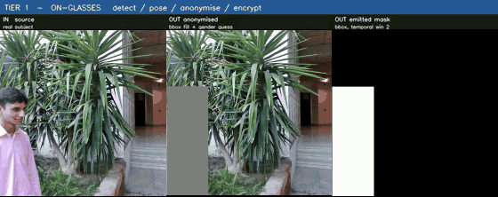
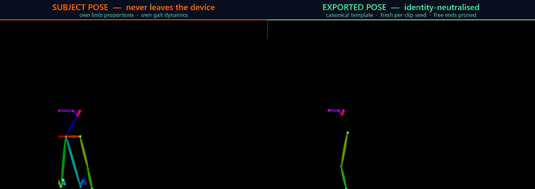

# Tier 1: On-Device Privacy Enforcement

## Purpose

Tier 1 is the trusted capture service. It runs inside the wearable's execution boundary and is the
only component that ever sees raw bystander pixels. For every frame it detects and tracks people,
applies a fail-closed redaction, derives the identity-neutralised control signals the rest of the
system is allowed to use, and encrypts the material needed for a possible future consent-based
restoration. Nothing else leaves the device.



## Input

A video file (or a camera index). The reported runs used MP4, **1264 x 1264, 30 fps**. Nothing in
the code fixes the resolution; the frame rate matters because the downstream bundle contract is
30 fps.

## Output

Written to `--export-dir`:

| File | Content |
|---|---|
| `masked_video.mkv` / `masked_video.mp4` | Anonymised video: each person replaced by a uniform grey fill. The edge runner writes lossless FFV1, because a lossy codec lets DCT ringing re-expand the decoded mask past the erode margin and leak a ring of real background. |
| `mask.mp4` | Binary occupancy map of the redacted regions. |
| `pose.json` | Per frame, per person: anonymised COCO-17 keypoints and binarised confidences, plus a `meta` block recording the effective anonymisation configuration, the per-slot template kind, the slot policy, the auto-detected person count and `refused_spans`. |
| `face_scalars.json` | 12 identity-free expression scalars per person per frame, released under differential-privacy noise. |
| `manifest.json` | Per-slot stream id, apparent-gender flag and confidence, frames-with-face, packet/key filenames, skeleton-containment diagnostics, and the full effective configuration. |
| `crypto/stream_<uuid>.packet` | AES-128-GCM ciphertext of the JPEG-encoded person crops and the 512-d face embedding. |
| `crypto/stream_<uuid>.key` | The AES key, RSA-4096-OAEP-wrapped to the Tier-3 TTP's public key. |
| `keypoints_p*.npy`, `bboxes_p*.json`, `face_params_p*.npy`, `identities_p*.npy` | Dense per-slot export arrays consumed by the cloud bundle builder. |

Real examples of each JSON contract are in [`../examples/outputs/tier1/`](../examples/outputs/tier1/).

## Dependencies

[`requirements.txt`](requirements.txt). The tier is deliberately **torch-free**: onnxruntime (CPU),
`rtmlib`, MediaPipe, OpenCV, NumPy, `cryptography`, `insightface`. `ncnn` is needed only for the
NCNN detector backend (the Raspberry-Pi-canonical path); `opencv-contrib-python` only for the
guided-filter mask upscale, which falls back to bilinear resize when absent. `fastapi`, `uvicorn`
and `zeroconf` are needed only by the optional LAN handoff service in `src/tier1_link/`.

## Models

None are redistributed here. See [`../models/README.md`](../models/README.md) for
sources, expected filenames and licences. Tier 1 loads:

| Role | Model |
|---|---|
| Person detection | YOLO11n (NCNN for the Pi path; ONNX elsewhere) |
| Instance segmentation (edge runner, optional) | YOLO11n-seg |
| Pose | RTMPose-Tiny wholebody / body7, input 192 x 256, ONNX Runtime CPU |
| Face landmarks | MediaPipe FaceLandmarker (468 points) |
| Apparent-gender flag | InsightFace `genderage.onnx` (MobileNet-0.25) |
| Face embedding | EdgeFace-XS (gamma = 0.6), 512-d, L2-normalised, 112 x 112 |

## Configuration

Two codebases share this tier, and both ship here:

* **`src/mirage/`** is the capture service used for the reported end-to-end runs. Configured
  entirely through `scripts/run_tier1.py` command-line flags. Owns tracking, the apparent-gender
  flag, the face embedding, encryption and `manifest.json`.
* **`src/edge_runner_pi5/`** is the Raspberry-Pi-5 edge runner. Configured through `config.py`
  (107 knobs, each overridable by a `MIRAGE_*` environment variable). Owns the
  differential-privacy stage for the expression channel, FaceGuard, and the guided-segmentation
  mask source. Run it with `run.sh` or `python3 mirage_tier1.py`.

`src/mirage/vendor/mirage_edge/` holds the two re-identification defences, **vendored
byte-identical** from `src/edge_runner_pi5/` so that every privacy number measured against those
bytes still describes the deployed artifact. Do not edit files in that directory; fix them upstream
and re-vendor. `src/mirage/vendor/mirage_edge/VENDOR.md` records the digests, and
`tests/test_gait_mask_anon.py` enforces them.

> Path note: comments inside the vendored files refer to the internal development repository
> (`tree/mirage_edge_deploy/tier1_raspberry_pi5/`). That directory is `src/edge_runner_pi5/` here.
> The files themselves are unmodified so their digests still verify.

### Shipped anti-re-identification configuration

Applied to the skeletal controls before egress, all drawn under a fresh per-clip seed:

| Parameter | Shipped value | Scope |
|---|---|---|
| Anthropometric normalisation | canonical template, least-squares vertical-extent fit + seeded global-scale jitter of at most 0.10 | per clip |
| Joint-angle perturbation | 14 deg constant / 10 deg drift, **arm chains only** (legs exempt) | per clip |
| Limb-swing amplitude rescale | 0.25, about each limb chain's mean pose | per clip |
| Per-chain temporal phase | amplitude 1.80, constant offset drawn up to 0.35 s | per clip |
| Cadence re-timing | disabled; root trajectory locked to the subject's true path | n/a |
| Perturbation seed | cryptographically fresh per clip, never identity-derived | per clip |
| Free-end keypoint pruning | enabled | per frame |
| Silhouette mode | axis-aligned bounding box, 2-frame temporal window | per frame |



*Left: the pose the estimator produced. Right: what actually leaves the device: one shared
anatomical template, per-chain swing and phase from a fresh per-clip seed, free ends pruned.*

In the code, this whole configuration is what ships by default: the pose-anonymisation preset
(registered as `e2` in `pose_anon_edge.py`, the default of `gait_preset()`) together with
bounding-box masking (`mask_shape_mode=bbox`). Seeding **per sequence, never per identity** is load-bearing: an identity-derived
seed makes the perturbation itself a stable signature.

## Usage

```bash
# A TTP public-key endpoint must be reachable: Tier 1 refuses to generate a keypair locally,
# because holding the private key next to the data defeats the third-party split.
python ../tier3_restoration/scripts/ttp_stub.py <ttp_private_key.pem> 8843 &

python scripts/run_tier1.py <input.mp4> \
    --headless --no-save \
    --anonymizer yolo11n_boxfill \
    --gait-anon --gait-preset e2 \
    --mask-shape-mode bbox --mask-temporal-win 2 \
    --score-binarize-thresh 0.5 \
    --export-dir out_t1 --export-people <n_people> \
    --ttp-server http://127.0.0.1:8843 --ttp-http
```

`--skip-n` (default 5) sets the detection/pose interval; skipped frames propagate boxes, keypoints
and face mesh with pyramidal Lucas-Kanade optical flow. `run_tier1.py --help` lists every flag.

The Raspberry Pi 5 edge runner is a separate entry point:

```bash
cd src/edge_runner_pi5
bash run.sh --source <input.mp4>          # reads config.py; MIRAGE_* env vars override
```

## Pipeline

```text
frame ──> YOLO11n detection ──> identity tracker (greedy nearest-centroid, grace frames)
            │                        │
            │                        ├─> RTMPose-Tiny ──> COCO-17 keypoints ──> identity neutralisation ──> pose.json
            │                        ├─> MediaPipe FaceLandmarker ──> 12 expression scalars ──> DP noise ──> face_scalars.json
            │                        ├─> best face crop ──> InsightFace genderage ──> gender flag ──> manifest.json
            │                        ├─> best face crop ──> EdgeFace ──> 512-d embedding ─┐
            │                        └─> person crop (JPEG q70) ───────────────────────────┼─> AES-128-GCM ──> RSA-4096 wrap ──> crypto/
            │                                                                             │
            └─> box occupancy ──> silhouette mitigation (bounding box + temporal union) ──> grey fill ──> masked_video + mask
```

Detection and pose run every `--skip-n` frames; everything else is propagated by optical flow.
Ingestion, processing and writing run on separate threads with bounded queues so inference
back-pressure never drops an incoming frame.

## Expected Files

```text
tier1/
├── scripts/run_tier1.py                     entry point
├── src/mirage/                         capture service (pipeline, tracking, crypto, embedding, gender)
│   └── vendor/mirage_edge/                       byte-identical re-ID defences + VENDOR.md provenance
├── src/edge_runner_pi5/                     Raspberry Pi 5 runner (config.py-driven, DP stage)
├── src/tier1_link/                          optional mDNS + TLS LAN handoff to the phone
└── tests/                                   defence parity, provenance and contract tests
```

Model files must be placed where `../models/README.md` says before the entry point will run.

## Tests

```bash
python tests/test_gait_anon.py                  # 30 checks: adapter API, seeding, degenerate input
python tests/test_gait_mask_anon.py             # 12 checks: vendored-byte provenance, mask superset,
                                                #            bit-identity when the defences are off
python src/edge_runner_pi5/test_config_contract.py
```

`test_gait_mask_anon.py` asserts that the mask a mitigation emits is a strict **superset** of the
input mask (mitigation can only ever add grey, never reveal) and that the vendored defence files
still hash to the bytes the published privacy numbers were measured on. Both suites are pure
NumPy / OpenCV and need no models or footage.

## Notes

* **Enrolment is a deliberate scope reduction.** `SUBJECT_LOCK` enrols tracks in a short window
  from clip start; a track never enrolled contributes nothing downstream and is **not covered by
  the emitted mask**. Coverage results are therefore statements about enrolled, in-scope subjects.
  The refusal log is detection-limited (it records boxes, not presence), which `refused_spans` now
  states explicitly rather than implying a measurement.
* **Both defences default OFF in `src/mirage/`** and must be enabled with `--gait-anon` and
  `--mask-shape-mode`; the edge runner enables them by default. A run's `manifest.json` records
  the *effective* configuration, which is what should be quoted, because several `MIRAGE_*`
  environment variables mutate the level dictionaries at import time.
* **`--gait-preset ""`** selects the bare level knobs rather than the shipped preset. Leaving the
  flag unset selects the shipped pose-anonymisation preset (`e2`).
* **The expression channel is inert without the DP stage.** At the shipped budget the exported
  scalars are, to the precision of the measurements available, indistinguishable from pure Laplace
  noise; the downstream face renderer's correct behaviour is a stable neutral pose plus a
  data-independent idle animation.
