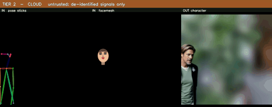

# Tier 2: Cloud Synthesis

## Purpose

The cloud tier is the **untrusted** half of Tier 2. It animates a synthetic human that reproduces a
bystander's posture, gestures and motion while carrying an entirely artificial identity. It is
deliberately given no way to learn who that bystander is: the only things that cross the boundary
are an illumination-preserving plate with all high-frequency detail destroyed, a bounding-box
occupancy video, a rendered *anonymised* skeleton, a 12-dimensional expression vector drawn onto a
generic face template, and a coarse apparent-gender flag.



## Input

The bundle produced by `scripts/build_cloud_bundle.py`, uploaded into the ComfyUI server's `input/`
directory. Exactly five video loaders reach the sampler graph, and every one of them names a Tier-1
or Tier-2 artifact. **No raw camera video and no face crop is loadable by the graph at all.**

| File | Origin | Content |
|---|---|---|
| `masked_video_00002.mp4` | Tier 1 via phone | The grey-filled plate over the abstracted lightmap |
| `mask_00002.mp4`, `mask_pK_00002.mp4` | Tier 1 | Union and per-slot bounding-box occupancy |
| `pose_sticks_pK_00002.mp4` | Tier 1, rendered | The anonymised COCO-17 skeleton |
| `facemesh_pK_00002.mp4` | Tier 1, rendered | Identity-free canonical expression mesh |
| `light_map.mp4` | Tier 2 phone | Low-frequency illumination |
| `reference_pK_640.png` | Supplied | The synthetic replacement identity |
| `MANIFEST.json` | Bundle builder | Slot list, effective configuration, provenance |

An example bundle manifest is at
[`../examples/outputs/tier2_cloud/BUNDLE_MANIFEST.json`](../examples/outputs/tier2_cloud/BUNDLE_MANIFEST.json).

## Output

`synthetic_person_pK.mp4` (the generated character) and `synthetic_alpha_pK.mp4` (a per-character
alpha matte, derived by re-detecting a person in the *generated* video and segmenting it). One
render is bound to one person slot.

## Dependencies

A ComfyUI installation (the reported runs used **ComfyUI 0.18.2**) plus these third-party node
packs, all installable through ComfyUI-Manager:

* `ComfyUI-WanVideoWrapper`: the video-diffusion sampler, LoRA stack and VAE
* `ComfyUI-WanAnimatePreprocess`: `pose_utils`, imported directly by `mirage_rtmpose`
* `ComfyUI-segment-anything-2`: SAM2 video segmentation for the alpha matte
* `ComfyUI-KJNodes`, `ComfyUI-VideoHelperSuite`: resize/mask/video utilities

Python packages: [`requirements.txt`](requirements.txt). The client-side tooling under `scripts/`
needs only NumPy, OpenCV and `ffmpeg`.

## Models

Not redistributed. See [`../models/README.md`](../models/README.md).

| Role | Model |
|---|---|
| Generator | `Wan2_2-Animate-14B_fp8_e4m3fn_scaled_KJ.safetensors`, `fp16_fast`, SDPA attention |
| LoRA stack (5 slots) | slot 0 empty (`none` 0) · `lightx2v_I2V_14B_480p_cfg_step_distill_rank64_bf16` 1.0 · `Wan2.1_HighRes_Textures` 0.3 · `Wan14B_RealismBoost` 0.35 · `Wan21_Camera_Rotation` **0.0** (loaded, disabled) |
| Video segmentation | `sam2.1_hiera_base_plus.safetensors`, fp16 |
| Re-detection for the matte | `vitpose-l-wholebody.onnx` + `yolov10m.onnx`, CUDA |

Place them where ComfyUI expects them (`models/diffusion_models`, `models/loras`, `models/sam2`,
`models/detection`). The detection directory is resolved from ComfyUI's own `folder_paths` when the
node is imported inside a ComfyUI process.

## Configuration

The generation settings used for the reported renders (registered in the code as operating point
`c4_van`) are fixed in the workflow JSON and re-asserted by the queue script before anything is
POSTed:

| Setting | Value |
|---|---|
| `WanVideoSampler` | steps 5 · cfg 1.0 · `dpm++_sde` · shift 5.0 · denoise 1.0 |
| `WanVideoAnimateEmbeds` | `frame_window_size` 77 · `pose_strength` 0.8 · `face_strength` 0.85 · colour-match off |
| Resolution | read at runtime from the loaded Tier-1 artifact; every reported bundle is 1264 x 1264 @ 30 fps |

`scripts/queue_render.py` holds these as `EXPECT_SAMPLER` / `EXPECT_LORAS` / `EXPECT_WINDOW` and
**refuses to queue** on any mismatch, so a graph edit cannot silently change what was rendered.

Environment overrides: `MIRAGE_COMFY_URL` (server base URL), `MIRAGE_COMFY_INPUT` (the server's
`input/` path, default `/workspace/runpod-slim/ComfyUI/input/`), `MIRAGE_BUNDLE_DIR` (the local
bundle, needed only for per-slot mask binding).

## Usage

```bash
# 1. Install the MIRAGE nodes into the ComfyUI installation and restart the server.
cp -r src/comfyui_custom_nodes/comfyui-mirage-gate  <ComfyUI>/custom_nodes/
cp -r src/comfyui_custom_nodes/mirage_rtmpose       <ComfyUI>/custom_nodes/
cp    src/comfyui_custom_nodes/mirage_autoref_node.py <ComfyUI>/custom_nodes/

# 2. Build the bundle from a Tier-1 export plus the phone's lightmap.
python scripts/build_cloud_bundle.py --tier1 out_t1 --tier2 tier2_out --out to_cloud --refs refs

# 3. Verify and audit it before uploading anything.
python scripts/verify_bundle.py --bundle to_cloud
python scripts/audit_bundle.py  --bundle to_cloud

# 4. Upload `to_cloud/` into the server's input/ directory, then convert + verify + queue.
curl -s http://<host>:8188/object_info > object_info.json
python scripts/queue_render.py --object-info object_info.json --url http://<host>:8188          # dry run
python scripts/queue_render.py --object-info object_info.json --url http://<host>:8188 --queue
```

## Pipeline

```text
bundle ──> VHS_LoadVideo x5 (plate, mask, sticks, facemesh, lightmap)
              │
              ├─> MIRAGEPersonGate ─── lazy branch skip: a 1-person detection never
              │                        executes the 2nd-person subgraph or its reference
              │
              ├─> GrowMaskWithBlur(expand 10, blur 4) ──> BlockifyMask(16) ──> the repaintable hole
              │
              ├─> reference identity  (manual PNG, or the silhouette-only auto-reference node)
              │
              └─> WanVideoAnimateEmbeds ──> WanVideoSampler ──> WanVideoDecode
                                                                    │
                                                                    ├─> synthetic_person_pK.mp4
                                                                    └─> PoseAndFaceDetection ──> Sam2Segmentation
                                                                                                    └─> synthetic_alpha_pK.mp4
```

## Expected Files

```text
tier2_cloud/
├── src/comfyui_custom_nodes/
│   ├── comfyui-mirage-gate/         MIRAGEPersonGate: lazy per-person branch skip
│   ├── mirage_rtmpose/              MIRAGEMaskPersonCount and the other MIRAGE graph nodes
│   ├── mirage_autoref_node.py       optional silhouette-only reference generation + egress guard
│   └── test_egress_guard.py         the guard's own test
└── scripts/
    ├── build_cloud_bundle.py        assembles the bundle (this is the local privacy firewall)
    ├── npy_to_mirage_emit.py        Tier-1 .npy export -> pose.json / face_scalars.json
    ├── tier1_viz.py                 renders the anonymised skeleton and canonical face mesh
    ├── face_signal_filter.py        turns the DP-noised scalars into a stable face trajectory
    ├── verify_bundle.py             contract check
    ├── audit_bundle.py              independent privacy audit of the assembled bundle
    ├── check_render.py              QC of a returned render
    ├── ui2api.py                    UI workflow JSON -> API prompt, using a fetched /object_info
    └── queue_render.py              convert + assert the operating point + POST /prompt
```

The workflow graphs themselves are in
[`../workflows/tier2_cloud/`](../workflows/tier2_cloud/).

## Notes

* **The reference identity is never derived from the footage.** Deriving one would carry the real
  subject's appearance across the trust boundary. `build_cloud_bundle.py` therefore never generates
  a reference; `--refs` copies a supplied synthetic character sheet and records the carry-over in
  `MANIFEST.json` and `REFERENCE_IMAGES_README.txt` for human confirmation.
* **The optional auto-reference node uploads silhouettes only.** `MIRAGE_GeminiAutoRef` sees four
  or five flat grey silhouette frames (no face, skin, clothing texture or colour), and a per-frame
  `_egress_check` refuses to transmit any frame that is not statistically a flat silhouette. It is
  covered by `test_egress_guard.py`. The manual-reference path was used for the reported runs and
  makes no external API call at all.
* **The API-key widget on that node has been emptied** in the published workflow JSONs. Supply your
  own key if you enable the auto-reference branch.
* **Each render must be bound to ONE slot.** If both mask loaders point at the union mask, the
  sampler is told to generate inside every box, obliges, and the matte (which is derived by
  detecting a person in the generated video) then has two candidates and binds to the wrong one.
  `build_cloud_bundle.py` writes per-slot masks and `queue_render.py` binds them.
* **`V9_CLOUD_ONLY.json` carries a complete second-character subgraph, muted.** `ui2api.py` drops
  muted nodes during conversion, so it never reaches the server.
