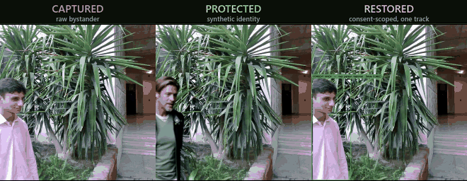

# Tier 3: Consent-Based Restoration

## Purpose

Tier 3 makes identity recovery an exceptional, regulated operation rather than a back door. It splits
authority three ways so that no single component can reconstruct a person on its own:

* the **glasses** remove appearance from everything they emit, and hold no key that can undo it;
* the **companion phone** holds the encrypted material but no key;
* the **trusted third party (TTP)** holds the key material but never receives media.

An approval releases exactly the AES keys bound to one recording, one bystander track and one
capture interval. Everyone else in the same recording stays synthetic.



*The same frame at three points in its life. Restoration changes only the consenting
bystander's own track; anyone else in the recording remains synthetic.*

---

## Implementation status (read this first)

| Part of the protocol | Status in this repository |
|---|---|
| Per-person AES-128-GCM packet (person crops + face embedding) | **Implemented**: `../tier1/src/mirage/tracking.py`, `encryption.py` |
| RSA-4096-OAEP wrapping of the AES key to the TTP's public key | **Implemented**: `encryption.py` |
| Fetching the TTP public key over HTTP(S) with no local-keypair fallback | **Implemented**: `encryption.py:fetch_ttp_public_key` |
| 512-d face embedding used for identity matching | **Implemented**: `../tier1/src/mirage/embedding.py` |
| TTP `GET /v1/public-key` endpoint | **Stub only**: `scripts/ttp_stub.py` |
| TTP-side key unwrap and packet decryption primitives | **Implemented**: `encryption.py:rsa_decrypt_key`, `aes_gcm_decrypt` |
| Embedding matching, track merging, consent dispatch, scoped key release | **Not implemented in this release** |
| On-phone re-compositing of a restored track | **Not implemented in this release** |

The consent server is referenced in the code as `src/tier3_ttp/server.py`; **no such module exists in
this repository**. The restoration shown in the demonstration GIF was produced by decrypting the
packets with the test key that `ttp_stub.py` serves, standing in for the release step. Treat the
matching and consent flow as design, not as running code. See
[`../docs/architecture.md`](../docs/architecture.md) for the intended protocol.

---

## Input

Produced by Tier 1, under its `--export-dir`:

```text
manifest.json                          slots[].packet_file, slots[].key_file, gender, frames_with_face
crypto/stream_<uuid>.packet            AES-128-GCM ciphertext
crypto/stream_<uuid>.key               the AES key, RSA-4096-OAEP-wrapped to the TTP public key
```

`manifest.json` carries no identity-bearing content itself: a random stream UUID, the apparent-gender
flag, per-slot counters and the effective configuration. A real one is in
[`../examples/outputs/tier1/manifest.json`](../examples/outputs/tier1/manifest.json).

## Output

The plaintext recovered from an authorised packet: the JPEG-encoded person crops for that track and
its 512-dimensional L2-normalised face embedding. Compositing those crops back over the synthetic
avatar track happens on the companion device.

## Dependencies

[`requirements.txt`](requirements.txt): `cryptography` only. The primitives themselves live in
`../tier1/src/mirage/encryption.py`, because Tier 1 is where the envelopes are minted; this tier
is the counterpart that opens them.

## Models

None. Identity matching consumes the 512-d embedding Tier 1 already computed; the reported threshold
for a conservative match is a cosine similarity of 0.65.

## Configuration

`ttp_stub.py` takes a PEM private key path and a port:

```bash
python scripts/ttp_stub.py <ttp_private_key.pem> 8843
```

Tier 1 is pointed at it with `--ttp-server http://127.0.0.1:8843 --ttp-http`. **No private key is
distributed with this repository.** Generate one:

```bash
python -c "from cryptography.hazmat.primitives.asymmetric import rsa; \
from cryptography.hazmat.primitives import serialization as s; \
k = rsa.generate_private_key(public_exponent=65537, key_size=4096); \
open('ttp_private_TESTONLY.pem','wb').write(k.private_bytes(s.Encoding.PEM, \
s.PrivateFormat.PKCS8, s.NoEncryption()))"
```

A key generated this way is for local testing only. In deployment the private half exists solely
inside the TTP; Tier 1 deliberately refuses to generate a keypair locally, because holding the
private key next to the data it protects defeats the entire third-party split.

## Usage

```bash
# 1. Serve the TTP public key.
python scripts/ttp_stub.py ttp_private_TESTONLY.pem 8843 &

# 2. Run Tier 1 against it; envelopes appear under out_t1/crypto/.
python ../tier1/scripts/run_tier1.py <input.mp4> --export-dir out_t1 \
    --ttp-server http://127.0.0.1:8843 --ttp-http   # (plus the flags in ../tier1/README.md)

# 3. Open one envelope with the TTP-side primitives. This stands in for the key-release step:
#    in deployment the TTP performs the unwrap and returns only the AES key, never the plaintext.
python - <<'PY'
import json, sys
sys.path.insert(0, "../tier1/src")
from cryptography.hazmat.primitives import serialization
from mirage.encryption import rsa_decrypt_key, aes_gcm_decrypt

priv = serialization.load_pem_private_key(open("ttp_private_TESTONLY.pem", "rb").read(), password=None)
man  = json.load(open("out_t1/manifest.json"))
slot = man["slots"][0]
wrapped = open("out_t1/" + slot["key_file"], "rb").read()
aes_key = rsa_decrypt_key(wrapped, priv)          # TTP side, behind consent
packet  = open("out_t1/" + slot["packet_file"], "rb").read()
print("unwrapped a %d-bit AES key for stream %s" % (len(aes_key) * 8, slot["stream_id"]))
# aes_gcm_decrypt(aes_key, nonce, ciphertext) then recovers the crops and the embedding;
# the packet's nonce/framing layout is defined in ../tier1/src/mirage/tracking.py.
PY
```

## Pipeline

```text
TIER 1 (glasses)                    TIER 3 (TTP)                       TIER 2 (phone)
────────────────                    ────────────                       ──────────────
GET /v1/public-key  ───────────────>  RSA-4096 public key
                    <───────────────
per person:
  AES-128-GCM(crops ‖ embedding)
  RSA-OAEP(AES key)
  → .packet + .key
                                                        envelopes over TLS 1.3
                                    <───────────────────────────────────
                                    unwrap keys (private key)
                                    cosine-match embeddings vs the
                                      pre-registered template DB (≥ 0.65)
                                    merge fragmented tracks
                                    dispatch a consent prompt
                                      (session id + non-sensitive
                                       metadata only; never the wearer,
                                       the content, or the embedding)
                                    on approval: release ONLY the AES
                                      keys for track i, interval t
                                    ───────────────────────────────────>
                                                                        decrypt those crops
                                                                        composite over the
                                                                          synthetic track
                                                                        (all local; no media
                                                                         is ever uploaded)
```

The steps drawn inside the TTP box between "unwrap keys" and "release" are the part that is not
implemented here.

## Expected Files

```text
tier3_restoration/
├── README.md
├── requirements.txt
└── scripts/ttp_stub.py       serves GET /v1/public-key, the one endpoint Tier 1 calls
```

## Notes

* **Restoration is non-transitive.** A released key opens one track over one interval. Consent from
  one bystander does not expose anyone else in the same recording.
* **A refused person has no envelope.** Enrolment is what creates a per-person stream; someone the
  capture service refused is neither masked nor recoverable. That asymmetry is a property of the
  enrolment policy, not of this tier; see the note in [`../tier1/README.md`](../tier1/README.md).
* **`ttp_stub.py` is a stub and makes no security claim.** It serves a public key and nothing else,
  and the test private key sits next to it on disk by construction.
* **TLS handling is not hardened.** `fetch_ttp_public_key(..., verify_tls=False)` matches the
  self-signed, trust-on-first-use certificate used by the LAN handoff service; real trust should come
  from fingerprint pinning rather than from skipping verification.
